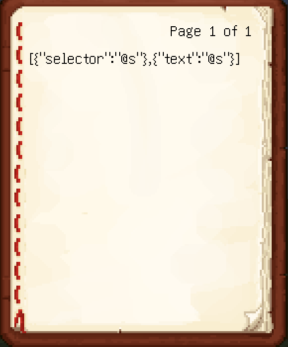
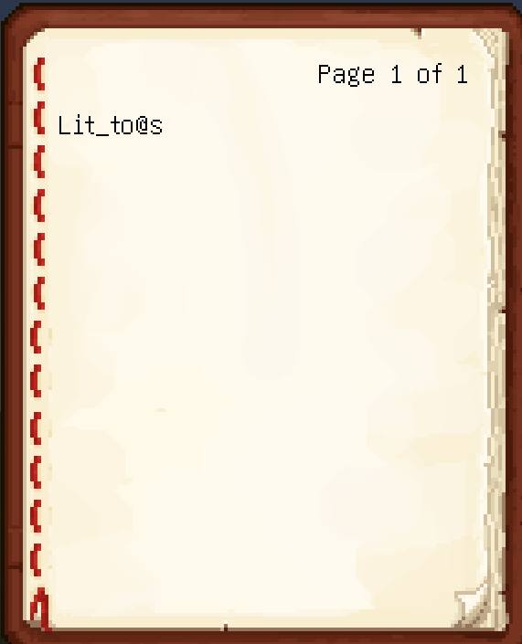

# 本に記入したプレイヤーセレクターが働かない
-   2023-07-22 10:46:11
-   準備中
# 目次
- [本に記入したプレイヤーセレクターが働かない](#本に記入したプレイヤーセレクターが働かない)
- [目次](#目次)
- [概要](#概要)
- [報告状況](#報告状況)
    - [確認済みバージョン](#確認済みバージョン)
    - [確認・修正状況](#確認修正状況)
    - [その他](#その他)
- [検証](#検証)
- [結果](#結果)

# 概要

今回は[MC-103171](https://bugs.mojang.com/browse/MC-103171)、``Selectors in written books require player to be operator to work``について紹介。
日本語だと本に書かれたプレイヤーセレクタが動かない
ただし、opを持って本を開けばきちんとプレイヤセレクタが動く

# 報告状況
## 確認済みバージョン

(それ以前のいっぱい)
-   1.19.3
-   1.19.4
-   1.20
-   1.20.1(配信時点では未実装ver.)

要素:コマンド

## 確認・修正状況
-   [x] 確認済み
-   [ ] 未修正

## その他
かなり昔からこのバグがあるよう・・・ 
脱出マップ等を作成しようとしたときに、opなしで本を配布するということはよくある出来事なので当たったことある人も多いような気がする
# 検証
-   opがない時↓

-   opがある時↓

# 結果
書いてある通り、opを持っていないと働かない模様(1.20.1現在)

2023-07-22 10:46:11