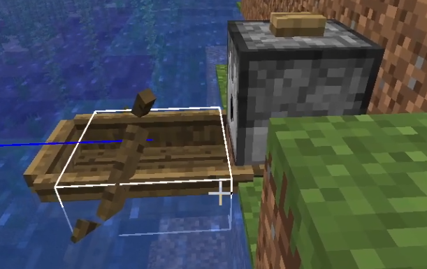
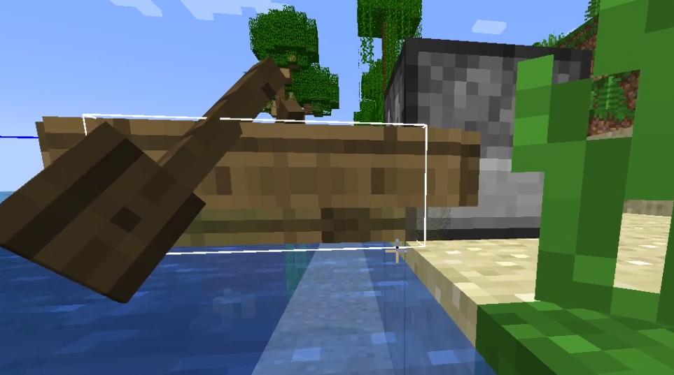

# ディスペンサーから出されたボートがブロックにスタックする
-   2023-09-07 17:32:35
-   準備中
# 目次
- [ディスペンサーから出されたボートがブロックにスタックする](#ディスペンサーから出されたボートがブロックにスタックする)
- [目次](#目次)
- [概要](#概要)
- [報告状況](#報告状況)
    - [最新の確認済みバージョン](#最新の確認済みバージョン)
    - [確認・修正状況](#確認修正状況)
- [検証](#検証)
- [結果](#結果)

# 概要

Source:[MC-1310](https://bugs.mojang.com/browse/MC-1310)、``Dispensed boats and rafts get stuck inside of dispensers used to place them``

# 報告状況
## 最新の確認済みバージョン
-   1.19.4

## 確認・修正状況
-   [x] 確認済み
-   [x] 修正済み
    -   Minecraft 15w47a
    -   1.20 Pre-release 2 

# 検証
v1.20.1↓

v1.19.4↓

# 結果
気のせい程度ではあるが、若干修正された

