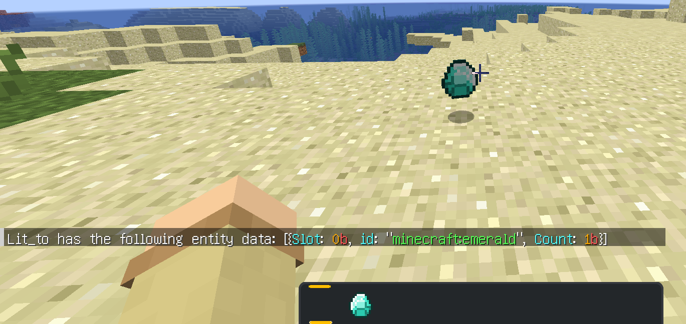

# ホットバーのスロットを切り替える時に同時にアイテムを投げると同期ズレが発生する
-   2023-09-05 20:28:39
-   準備中
# 目次
- [ホットバーのスロットを切り替える時に同時にアイテムを投げると同期ズレが発生する](#ホットバーのスロットを切り替える時に同時にアイテムを投げると同期ズレが発生する)
- [目次](#目次)
- [概要](#概要)
- [報告状況](#報告状況)
    - [確認済みバージョン](#確認済みバージョン)
    - [確認・修正状況](#確認修正状況)
- [検証](#検証)
- [結果](#結果)

# 概要

Source:[MC-154881](https://bugs.mojang.com/browse/MC-154881)、``Dropping an item from your hotbar at the same time as switching to another hotbar slot desyncs the second item``

# 報告状況
## 確認済みバージョン

(それ以前のいっぱい)
-   1.19
-   1.19.2
-   1.19.3
-   1.19.4
-   1.20

## 確認・修正状況
-   [x] 確認済み
-   [ ] 未修正

# 検証

1.  ホットバーに2つアイテム持つ(以下A,B)
2.  Aを持つ
3.  Bを持つ&アイテムを捨てる動作を**同時に**行う
4.  この時ホットバーからBが無くなっているのに、ドロップしているものがAとなる

# 結果

-   投げたアイテムは見たまま、インベントリの情報が不自然
    -   Slot:0b:`data get entity @s SelectedItem`を見ると、アイテムが残ったままになっている
    -   Slot:1b:`data get entity @s SelectedItem`を見ると、アイテムがなくなっている

ちなみに、Aがピッケルだと手に何も持たないのに石が採掘できる
耐久値が変わる、インベントリをクリックする、等更新すると本来持ってるアイテムだけが持っているようになる

2023-09-05 20:28:39

