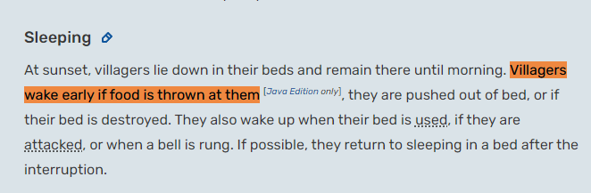
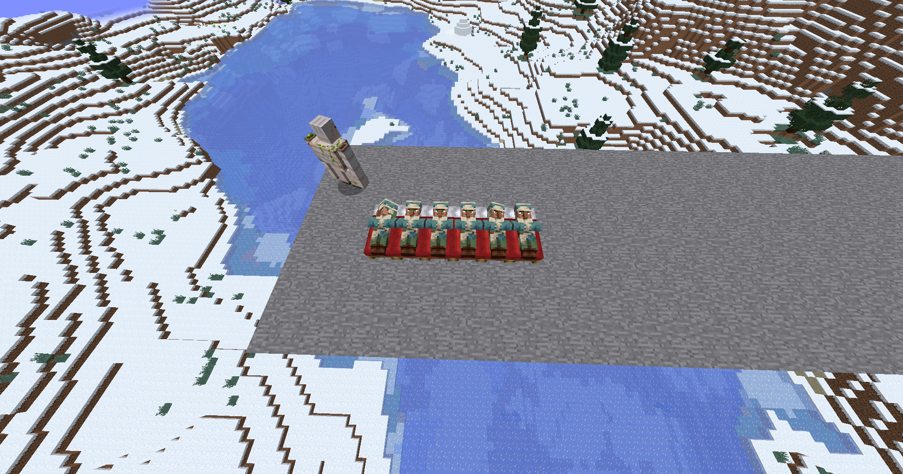

# 目次
- [目次](#目次)
- [寝ている村人に食べ物を投げると動く、起きてしまう](#寝ている村人に食べ物を投げると動く起きてしまう)
- [バグレポート情報](#バグレポート情報)
    - [確認済みバージョン](#確認済みバージョン)
    - [確認・修正状況](#確認修正状況)
- [wikiチェック](#wikiチェック)
- [検証](#検証)
- [結果](#結果)

# 寝ている村人に食べ物を投げると動く、起きてしまう

~~夜這いしているような動きを見せるのでなんかキモい。~~
[``Villagers move around in bed or even leave the bed when food is thrown at them``](https://bugs.mojang.com/browse/MC-157464)の紹介
Duplication(同じバグ報告)が32件存在している

寝ている村人に食べ物を投げると起きてしまう？
-   バグレポではパンのみ

# バグレポート情報
## 確認済みバージョン
(SSは除く)

-   1.14.4
-   1.15
-   1.15.2
-   1.16.1
-   1.16.4

要素:モブのふるまい(村人)

## 確認・修正状況
-   [x] 確認済み
-   [ ] 未解決

-   Duplication(被り):32件

# wikiチェック
wikiの村人のページ(https://minecraft.fandom.com/wiki/Villager#Sleeping )には
  
と既に記載あり、バグではなく限りなく仕様？

# 検証
1.  村人を並べる
2.  夜にする(見づらいので暗視)

-   村人が寝るはず
3.  食べ物を投げる  

# 結果

-   パン
[動画ファイル](bugs\157464\2023-07-19_12-46-54.mp4)
→言う通りパンに寄せられる

-   それ以外の食べ物
[動画ファイル](bugs\157464\2023-07-19_12-46-03.mp4)
→人参、ジャガイモには反応ありそう

