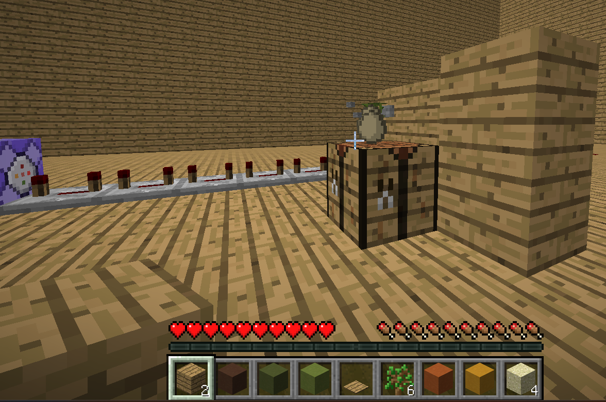

# keepInventoryがあってもGUIに配置中のアイテムがドロップする
-   2023-10-05 17:21:28
-   準備中
# 目次
- [keepInventoryがあってもGUIに配置中のアイテムがドロップする](#keepinventoryがあってもguiに配置中のアイテムがドロップする)
- [目次](#目次)
- [ソース](#ソース)
- [報告状況](#報告状況)
    - [最新の確認済みバージョン](#最新の確認済みバージョン)
    - [ステータス](#ステータス)
    - [内容](#内容)

# ソース
-   [MC-234511](https://bugs.mojang.com/browse/MC-234511)(``After dying, items inside of a temporary GUI slot will be dropped even with the keepInventory gamerule enabled``)

# 報告状況
## 最新の確認済みバージョン
-   1.20.2

## ステータス
-   未解決

## 内容
作業台やインベントリの作業欄、エンチャント台などの一時的にアイテムを置くだけのGUIにアイテムを置いて死ぬと**keepInventoryがTrueにも関わらず**ドロップしてしまう。

