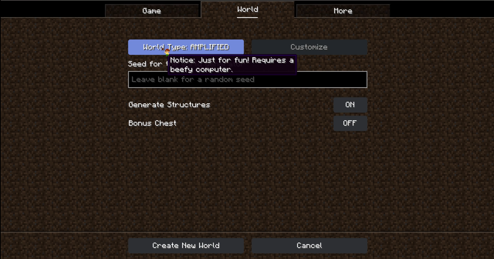
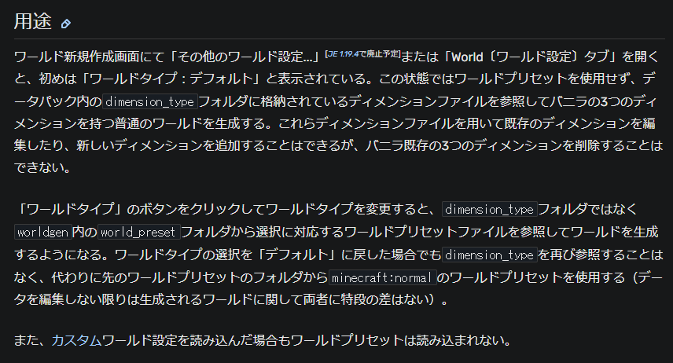

# 目次
- [目次](#目次)
- [設定ボタン押さないとワールドプリセットが働かない](#設定ボタン押さないとワールドプリセットが働かない)
- [報告状況](#報告状況)
    - [確認済みバージョン](#確認済みバージョン)
    - [確認・修正状況](#確認修正状況)
    - [その他](#その他)
- [検証](#検証)
    - [ワールドプリセットについて](#ワールドプリセットについて)
    - [手順](#手順)
- [結果](#結果)

#  設定ボタン押さないとワールドプリセットが働かない
**この内容は実験的機能の一部です**
今回は[MC-260949](https://bugs.mojang.com/browse/MC-260949)、``Overriding the default world type doesn't work until all presets are cycled through``について紹介。
タイトルをそのまま日本語に直すなら、｢設定ボタンを押さないとワールドプリセット機能が働かない｣が近い

# 報告状況
※ここに書いているものはバグレポートの情報をそのまま記載
## 確認済みバージョン

-   1.19.3
-   1.19.4 Release Candidate 2
-   1.19.4 Release Candidate 3
-   1.19.4
-   1.20 Release Candidate 1
-   1.20(配信時点では未実装ver.)

要素:データパック

## 確認・修正状況
-   [x] 確認済み
-   [ ] 未修正

## その他
どうやらスナップショット(以下SS)``23w07a``で一時的に直されたものの、1.19.4 pre-relese1で再発したそう

# 検証
## ワールドプリセットについて
カスタムワールドプリセットとは、データパックの要素のひとつで地形生成のルールを自由に変更することが出来るもの
詳細は[こちらのwiki](https://minecraft.fandom.com/ja/wiki/%E3%82%AB%E3%82%B9%E3%82%BF%E3%83%A0%E3%83%AF%E3%83%BC%E3%83%AB%E3%83%89%E3%83%97%E3%83%AA%E3%82%BB%E3%83%83%E3%83%88)へ
※なお、この機能は1.19 ``22w11a``から実装されたもの
## 手順
1.  おいてあるデータパックをダウンロードする
※バグレポートにおいてあるzipファイルはデフォルトの``minecraft:deep_dark``を書き換えるもの
2.  ワールドタイプを回さないでデータパックを有効にしたうえでワールドを生成する
    1.  このときワールドプリセットが無視される
3.  ワールドタイプを回して同じことをする
    1.  ワールドプリセットが有効になる

# 結果
どうやら書いてある通り、設定を動かさないと働かない模様(1.20現在)
ただ、wikiを読むと

とあり、現状ではwikiには書かれているものの実装当時のSS(``22w11A``)には特に書かれていない。

